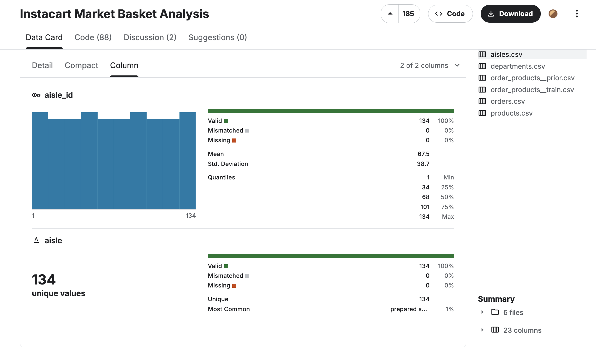

# 📓 Data Cleaning Journal – Insta Dataset

**Date:** `2025-10-07`  
**Author:** `Calista Jajalla`  
**Dataset:** [Instacart Market Basket Analysis](https://www.kaggle.com/datasets/psparks/instacart-market-basket-analysis/data?select=aisles.csv) (`aisles`, `departments`, `products`, `orders`, `order_products_prior`, `order_products_train`)  
**Purpose:** Consolidate **data quality checks**, validate **table integrity**, and create **metrics for dashboards**.

---

## 🔗 Table of Contents

- [1️⃣ Overview](#1️⃣-overview)  
- [2️⃣ Setup – DQ Log Table](#2️⃣-setup--dq-log-table)  
- [3️⃣ Global Checks](#3️⃣-global-checks)  
  - [3.1 Row Counts](#31-row-counts)  
  - [3.2 Primary Key Uniqueness](#32-primary-key-uniqueness)  
- [4️⃣ Table-Level Checks & Story](#4️⃣-table-level-checks--story)  
  - [4.1 Aisles](#41-aisles)  
  - [4.2 Departments](#42-departments)  
  - [4.3 Products](#43-products)  
  - [4.4 Orders & Order Products](#44-orders--order-products)  
  - [4.5 Reorder & Foreign Key Checks](#45-reorder--foreign-key-checks)  
- [5️⃣ Checklist for Data Cleaning Story](#5️⃣-checklist-for-data-cleaning-story)  
- [6️⃣ Next Steps & Links](#6️⃣-next-steps--links)

---

## 1️⃣ Overview

**Goal:** Ensure raw data integrity and prepare it for downstream analytics. We focus on six core **data quality categories**:

- **Volume Checks:** row counts and totals.  
- **Uniqueness Checks:** primary key uniqueness.  
- **Completeness Checks:** critical fields not null or empty.  
- **Referential Integrity:** foreign keys match related tables.  
- **Domain/Range Checks:** values within expected ranges.  
- **Duplicates & Anomalies:** detect full-row duplicates and logical inconsistencies.

**Workflow:**

1. Inspect raw tables in Kaggle (valid, mismatched, missing, unique, and most common)
2. Apply DQ checks (SQL queries).  
3. Store results in a central DQ log table: `raw._cali_insta__dq_checks`.  
4. Analyze outcomes (status: PASS/WARN/FAIL).


---

## 2️⃣ Setup – DQ Log Table

I created a **central table** to store all DQ metrics, with each row represents one check. Having a central log allows us to track historical DQ results, summarize KPIs, and build dashboards.

```sql
CREATE TABLE IF NOT EXISTS raw._cali_insta__dq_checks
(
    check_time DateTime DEFAULT now(),
    table_name String,
    check_name String,
    status UInt8,        -- INFO=0, PASS=1, WARN=2, FAIL=3
    metric_value Float64,
    metric_text String
)
ENGINE = MergeTree()
ORDER BY (table_name, check_time);
```
# 📊 DQ Log Table Columns

| Column         | Type     | Purpose                                                                            |
| -------------- | -------- | ---------------------------------------------------------------------------------- |
| `check_time`   | DateTime | Timestamp of the DQ check. Defaults to `now()`.                                    |
| `table_name`   | String   | Table being checked (e.g., `raw___insta_orders`).                                  |
| `check_name`   | String   | Name of the DQ rule (e.g., `row_count`, `distinct_product_id`).                    |
| `status`       | UInt8    | Numeric indicator of check result. Values: `0=INFO`, `1=PASS`, `2=WARN`, `3=FAIL`. |
| `metric_value` | Float64  | Numeric value of the metric (e.g., row count, percentage nulls, reorder rate).     |
| `metric_text`  | String   | Human-readable description of the metric or rule (helps dashboards & logs).        |

---

# 🟢 Status Codes

The `status` column is central to interpreting results.

## 0 – INFO
- **Purpose:** Used for informational checks.  
- **Example:** Logging row counts just for awareness, not as a strict DQ rule. It’s a soft check and does **not trigger alerts**.

## 1 – PASS
- **Purpose:** Check passed successfully.  
- **Example:** Row counts within expected range, primary keys are unique, foreign keys all valid. Indicates **healthy data**.

## 2 – WARN
- **Purpose:** Check is borderline or slightly outside expected thresholds.  
- **Example:** Minor missing values (<5%), reorder rate slightly off. Alerts you that **review may be needed**, but it isn’t critical.

## 3 – FAIL
- **Purpose:** Check failed or violated critical rules.  
- **Example:** Duplicate primary keys, required fields null, FK references missing. Signals **urgent action needed**.


### Sample DQ Results:

Below is a **preview of the DQ checks** for the Insta dataset. Full results are saved in the CSV file: [full results CSV](data/insta_dq_checks.csv).

| check_time         | table_name                      | check_name                    | status | metric_value     | metric_text                                |
|-------------------|--------------------------------|-------------------------------|--------|----------------|-------------------------------------------|
| 2025-10-07 13:33:46 | raw___insta_order_products_train | order_fk_missing              | 1      | 0              | order_id not found in orders               |
| 2025-10-07 13:33:46 | raw___insta_order_products_train | product_fk_missing            | 1      | 0              | product_id not found in products           |
| 2025-10-07 13:33:46 | raw___insta_order_products_train | reorder_rate_baseline         | 1      | 59.8594412751  | expected reorder ~59%                      |
| 2025-10-07 13:33:46 | raw___insta_order_products_train | add_to_cart_order_min_ge1     | 1      | 1              | min add_to_cart_order should be >=1        |
| 2025-10-07 13:33:46 | raw___insta_order_products_train | reordered_domain              | 1      | 0              | reordered not in {0,1}                     |

